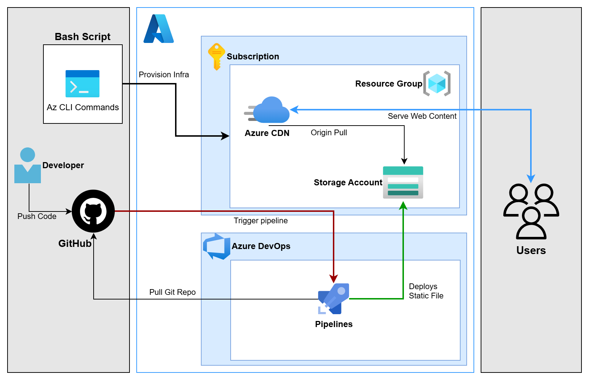

# Static Website Hosting with CI/CD-Automation
> Static Website Hosting on Azure Cloud and CI/CD with Azure DevOps

### 📌Overview
This project is a demonstration of hosting a static website on Azure Cloud by using Azure Blob Storage, Azure CDN for global content delivery, and Azure DevOps to automate the deployment process through a CI/CD pipeline that purges the CDN cache and uploads the latest website content to Azure Storage.

### 🏗️Setup Architecture

### 📋Prerequisites
- An active Azure Subscription with sufficient permissions.
- An App Registration with a Service Principal configured in Microsoft entra ID.
- A Service Connection set up in Azure DevOps linked to your Azure Subscription.
- An Azure Blob Storage Account with static website hosting enabled.
- An Azure CDN Profile and Endpoint connected to the Storage Account.
- A Self-hosted Azure DevOps Agent configured and running.

### ⚙️How It Works
- **Push code**  — Developer pushes the latest website code.
- **Trigger Pipeline** — Azure DevOps pulls it and the pipeline gets triggered automatically upon every push.
- **Deploy** — The pipeline deploys the static assets to the Azure Storage Account.
- **Azure CDN** —  pulls the latest content from the Storage Account and serves the website content globally to end users.

### 🪧Demonstration
